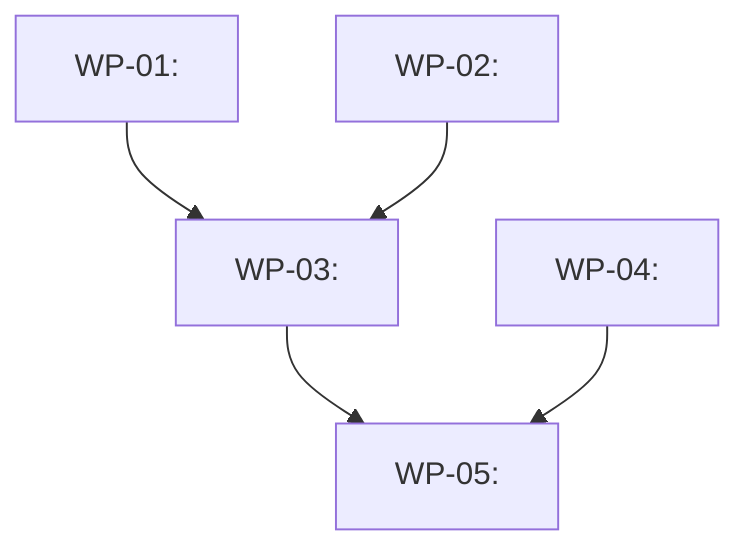

# Work Plan Generator

Break a feature specification into parallelizable, self-contained work packages (WPs) that agents can execute independently.

## Arguments

This command takes arguments: `$ARGUMENTS`

Expected format: `<spec-path>`

| Parameter | Required | Description |
|-----------|----------|-------------|
| `spec-path` | Yes | Path to a SPEC.md file (from `/spec-interview` or manually written) |

**Examples:**
```
/decompose-spec SPEC.md
/decompose-spec docs/specs/auth-flow.md
/decompose-spec ./features/dashboard-spec.md
```

## Workflow

Execute these steps in order. **Announce at start:** "Using /workplan to break this spec into agent-ready work packages."

### Step 1: Ingest Spec

Read the spec file at the provided path. If the file doesn't exist or is empty, fail with a clear error (see Error Handling table).

Extract from the spec:
- Feature name (for directory naming — kebab-case, e.g. `user-auth`)
- Goal / overview
- All requirements (functional, technical, UI/UX)
- Data models, API signatures, component shapes
- Constraints, edge cases, non-goals
- Any explicit ordering or dependency language ("requires", "depends on", "after", "before")

### Step 2: Explore Codebase

Use the Explore agent (Task tool with subagent_type=Explore) to ground the spec in the actual codebase. Discover:

- **Existing patterns:** How similar features are structured (file layout, naming conventions, test patterns)
- **Concrete file paths:** Files that will be created or modified — use real paths, not placeholders
- **Tech stack details:** Frameworks, libraries, test runners, build tools in use
- **Integration points:** Where new code connects to existing code (imports, registrations, config files)
- **Relevant reference files:** Existing implementations that WP agents should study as examples

This step is critical — WPs must reference real file paths and existing patterns, not abstract descriptions.

### Step 3: Identify Work Boundaries

Analyze the spec to find natural divisions of work. Look for:

- **Data layer boundaries:** Models, schemas, migrations, seed data
- **API/service boundaries:** Endpoints, handlers, middleware, business logic
- **UI boundaries:** Pages, components, forms, state management
- **Infrastructure boundaries:** Config, environment, deployment, CI changes
- **Cross-cutting concerns:** Auth, validation, error handling, logging

Each work package should be:
- **Independently implementable** — an agent can complete it without waiting for other WPs
- **Testable in isolation** — has its own verification commands
- **Small enough to review** — one logical unit of work
- **Large enough to be meaningful** — not a single-line change

### Step 4: Infer Dependencies

Apply these rules in priority order to determine WP dependencies:

1. **Explicit spec language** — "requires", "depends on", "after", "blocked by"
2. **Data models before consumers** — schemas/types before code that imports them
3. **Infrastructure/config before features** — env vars, packages, config before feature code
4. **Backend before frontend** — API endpoints before UI that calls them
5. **Core/happy path before edge cases** — primary flow before error handling, validation
6. **Shared utilities before consumers** — helpers, hooks, contexts before components using them
7. **Integration/E2E tests last** — after all units they exercise are complete

Build a directed acyclic graph (DAG) of WP dependencies.

### Step 5: Assign Phases via Topological Sort

Group WPs into sequential phases based on the dependency graph:

- **Phase 1:** WPs with no dependencies (can all run in parallel)
- **Phase 2:** WPs whose dependencies are all in Phase 1 (can all run in parallel after Phase 1 completes)
- **Phase N:** WPs whose dependencies are all in Phase N-1 or earlier

This maps directly to the `dispatching-parallel-agents` pattern: run all WPs in Phase N simultaneously, wait for completion, then start Phase N+1.

### Step 6: Show Preview

Display the full work plan for user review. Format:

```
## Work Plan Preview: <Feature Name>

**Source:** <spec-path>
**Work Packages:** <count>
**Phases:** <count>

### Dependency Graph

(Describe the mermaid graph that will be generated — which WPs depend on which)

### Phase Execution Table

| Phase | WPs (parallel) | Description |
|-------|----------------|-------------|
| 1     | WP-01, WP-02   | Foundation: data models, config |
| 2     | WP-03, WP-04   | Core: API endpoints, services |
| 3     | WP-05          | UI: components and pages |
| ...   | ...            | ... |

### Work Package Summaries

**WP-01: <name>** (Phase 1)
  Goal: <one line>
  Files: <key files created/modified>
  Depends on: (none)
  Complexity: low | medium | high

**WP-02: <name>** (Phase 1)
  ...

(repeat for all WPs)
```

### Step 7: User Approval Loop

Prompt the user using AskUserQuestion:

```
Work plan ready for review. What would you like to do?
```

**Options:**
- **Approve** — Write all files to `docs/plans/<feature-name>/`
- **Modify** — Change a WP's scope, goal, files, or acceptance criteria (ask which WP and what to change)
- **Merge** — Combine two WPs into one (ask which WPs)
- **Split** — Break a WP into two (ask which WP and where to split)
- **Reorder** — Change phase assignments or dependencies (ask what to change)
- **Abort** — Cancel without writing files

After any modification, re-run dependency analysis (Step 4) and phase assignment (Step 5) if dependencies changed, then show the updated preview again. Loop until the user approves or aborts.

### Step 8: Write Output Files

After approval, create the output directory and files:

```
docs/plans/<feature-name>/
  index.md
  wp-01-<name>.md
  wp-02-<name>.md
  ...
```

#### index.md Format

```markdown
# <Feature Name> Work Plan

> **For Claude:** Use `superpowers:dispatching-parallel-agents` to execute phases in parallel.
> Each WP file is a self-contained agent brief — dispatch one agent per WP within a phase.

**Goal:** <One sentence from spec>

**Architecture:** <2-3 sentences about the overall approach>

**Tech Stack:** <Key technologies/libraries>

**Source Spec:** `<spec-path>`

---

## Dependency Graph



## Execution Phases

| Phase | Work Packages | Run In Parallel | Gate |
|-------|--------------|-----------------|------|
| 1 | [WP-01](<wp-01-name>.md), [WP-02](<wp-02-name>.md) | Yes | All Phase 1 WPs pass verification |
| 2 | [WP-03](<wp-03-name>.md), [WP-04](<wp-04-name>.md) | Yes | All Phase 2 WPs pass verification |
| 3 | [WP-05](<wp-05-name>.md) | N/A | All WPs pass verification |

## Summary

| WP | Name | Phase | Key Files | Complexity |
|----|------|-------|-----------|------------|
| 01 | <name> | 1 | `path/to/file.ts`, ... | Medium |
| 02 | <name> | 1 | `path/to/file.ts`, ... | Low |
| ... | ... | ... | ... | ... |
```

#### WP File Format (wp-XX-<name>.md)

Each WP file must be **fully self-contained** — an agent reading only this file has everything needed to implement the work package. Never say "see the spec" or "refer to WP-03" without including the relevant content inline.

```markdown
# WP-XX: <Name>

**Phase:** N
**Depends on:** WP-YY (<name>), WP-ZZ (<name>) — or "None"
**Complexity:** Low | Medium | High

## Goal

<One paragraph describing what this WP builds and why it matters in the context of the feature. Standalone — an agent reading only this paragraph understands the purpose.>

## Background

<Relevant excerpts from the spec that this WP implements. Include architectural decisions, constraints, and existing patterns the agent should follow. Copy relevant content here — don't reference external files.>

**Existing patterns to follow:**
- `path/to/similar/file.ts` — <what to learn from it>
- `path/to/test/pattern.test.ts` — <test structure to mirror>

## Scope

**In scope:**
- <Bullet list of what this WP delivers>
- <Be specific: "Create UserModel with fields: id, email, name, createdAt">
- <Not vague: "Implement the data model">

**Out of scope (handled by other WPs):**
- <Thing> — see WP-XX
- <Thing> — see WP-YY

## Key Files

**Create:**
- `exact/path/to/new-file.ts` — <purpose>
- `exact/path/to/new-file.test.ts` — <what it tests>

**Modify:**
- `exact/path/to/existing.ts` — <what changes and why>

**Reference (read, don't modify):**
- `exact/path/to/reference.ts` — <why agent should read this>

## Technical Details

<Data models, API signatures, component props, type definitions — the WHAT, not the HOW. The implementing agent decides its own approach (TDD, etc.)>

<Include enough detail that the agent doesn't need to make design decisions — those are already made here. But don't dictate implementation steps.>

## Acceptance Criteria

- [ ] <Criterion 1 — specific and verifiable>
- [ ] <Criterion 2>
- [ ] <Criterion 3>
- [ ] All new code has test coverage
- [ ] No regressions in existing tests

## Verification Commands

```bash
# Run unit tests for this WP
<exact test command>

# Type check
<exact type check command>

# Lint
<exact lint command>

# Build (if applicable)
<exact build command>
```
```

### Step 9: Execution Handoff

After writing all files, present the execution options:

```
Work plan written to docs/plans/<feature-name>/

<count> work packages across <count> phases.

**Execution options:**

1. **Parallel agents (this session)** — I'll use `dispatching-parallel-agents` to run each phase,
   dispatching one agent per WP within a phase. Fast, parallel, stays in this session.

2. **Subagent-driven (this session)** — I'll use `subagent-driven-development` to execute WPs
   sequentially with two-stage review (spec compliance + code quality). Thorough, reviewed.

3. **Manual** — You execute the WPs yourself or in separate sessions using the plan files.

Which approach?
```

If the user chooses option 1, use the `dispatching-parallel-agents` skill to execute.
If the user chooses option 2, use the `subagent-driven-development` skill to execute.
If the user chooses option 3, you're done.

## Error Handling

| Error | Action |
|-------|--------|
| Spec file not found | Error: "File not found: `<path>`. Check the path and try again." |
| Spec file is empty | Error: "Spec file is empty. Run `/spec-interview` first to generate a spec." |
| No clear feature name | Ask user for a feature name to use for the directory |
| Spec too vague for WPs | List what's missing, suggest running `/spec-interview` to flesh it out |
| `docs/plans/<name>/` already exists | Ask user: overwrite, use a different name, or abort |
| Circular dependencies detected | Show the cycle, ask user to clarify ordering |

## What NOT to Do

- Do NOT dictate implementation approach (TDD, order of operations) — WPs describe WHAT, the executing agent decides HOW
- Do NOT include code snippets in WPs — describe types, signatures, and shapes, not implementation
- Do NOT create WPs for "setup" or "cleanup" unless there's real work (don't pad the count)
- Do NOT reference other WP files without inlining the relevant context (each WP is self-contained)
- Do NOT skip codebase exploration — WPs with placeholder paths are useless
- Do NOT write files before user approval
